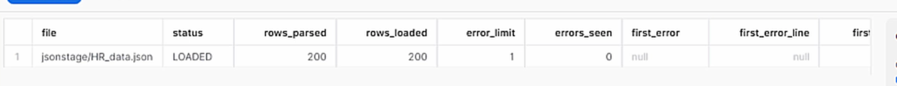

# 6-Ciclo-de-vida-compartición
1. [Time Travel y Fail Safe](#schema1)
2. [Tipos de tabla en Snowflake](#schema2)
3. [Compartir de datos con otra cuenta de Snowflake](#schema3)
4. [¿Cómo conectar Snowflake con Power BI o Python?](#schema4)

<hr>

<a name="schema1"></a>

## 1. Time Travel y Fail Safe


```sql
SELECT  FROM PRIMERABBDD.PRIMERESQUEMA.employees    
```


- Insertamos un error
```sql
UPDATE PRIMERABBDD.PRIMERESQUEMA.employees
SET FIRST_NAME = 'Juan' 
```


1. Time travel Método 1 (volver 2 minutos atrás)

```sql
SELECT * FROM PRIMERABBDD.PRIMERESQUEMA.employees at (OFFSET = -602)
```


2. Restaurar tabla original a través de una tabla backup para no eliminar los metadatos de la tabla original
```sql
CREATE OR REPLACE TABLE PRIMERABBDD.PRIMERESQUEMA.employees_backup as
SELECT * FROM PRIMERABBDD.PRIMERESQUEMA.employees at (OFFSET = -602)
```
3. Consultamos la tabla de backup
```sql
SELECT * FROM PRIMERABBDD.PRIMERESQUEMA.employees_backup
```

4. Limpiamos la tabla original
```sql
TRUNCATE PRIMERABBDD.PRIMERESQUEMA.employees    
```
5. Insertamos los datos de la tabla backup en la tabla original
```sql
INSERT INTO PRIMERABBDD.PRIMERESQUEMA.employees
SELECT * FROM PRIMERABBDD.PRIMERESQUEMA.employees_backup
```
6. Consultamos la tabla
```sql
SELECT  FROM PRIMERABBDD.PRIMERESQUEMA.employees    
```


7. Borrar tabla de backup
```sql
DROP PRIMERABBDD.PRIMERESQUEMA.employees_backup
```

- Método 2 time stamp:
```sql
SELECT * FROM PRIMERABBDD.PRIMERESQUEMA.employees before (timestamp = '2023-08-16 073047.145'timestamp)
```
- Método 3 query ID:
```sql
SELECT * FROM PRIMERABBDD.PRIMERESQUEMA.employees before (statement = '019b9ee5-0500-8473-0043-4d8300073062')
```


<hr>

<a name="schema2"></a>


## 2. Tipos de tabla en Snowflake 


<hr>

<a name="schema3"></a>

## 3. Compartir de datos con otra cuenta de Snowflake


### **EN LA CUENTA DEL PRODUCTOR DE DATOS**

1. Crear objeto share
```sql
CREATE OR REPLACE SHARE ORDERS_SHARE;
```
**Dar permisos**

2. Permiso a BBDD
```sql
GRANT USAGE ON DATABASE PRIMERABBDD TO SHARE ORDERS_SHARE; 
```
3. Permiso a esquema
```sql
GRANT USAGE ON SCHEMA PRIMERABBDD.PRIMERESQUEMA TO SHARE ORDERS_SHARE; 
```

4. Permiso a tabla
```sql
GRANT SELECT ON TABLE PRIMERABBDD.PRIMERESQUEMA.ORDERS TO SHARE ORDERS_SHARE; 
```

5. Verificar permisos
```sql
SHOW GRANTS TO SHARE ORDERS_SHARE;
```


6. Añadir la cuenta del consumidor
cuenta_consumidor: es un indentificador que nos tiene que dar la otra cuenta con la que vamos a compartir.

```sql
ALTER SHARE ORDERS_SHARE ADD ACCOUNT=<cuenta_consumidor>;
```


### **EN LA CUENTA DEL CONSUMIDOR DE DATOS**
1. Ver las comparticiones conmigo
```sql
SHOW SHARES
```


2. Detalle del share
```sql
DESC SHARE ID.ORDERS.SHARE
```

3. Crear BBDD en la cuenta consumidor usando el share
```sql
CREATE DATABASE PRIMERABBDD FROM SHARE ID.ORDERS.SHARE
```
4. Validar resultados
```sql
SELECT * FROM PRIMERABBDD.PRIMERESQUEMA.ORDERS
```

<hr>

<a name="schema4"></a>

## 4. ¿Cómo conectar Snowflake con Power BI o Python?


[Script Python](6.5%20Conexión%20Snowflake%20-%20Python.ipynb)
